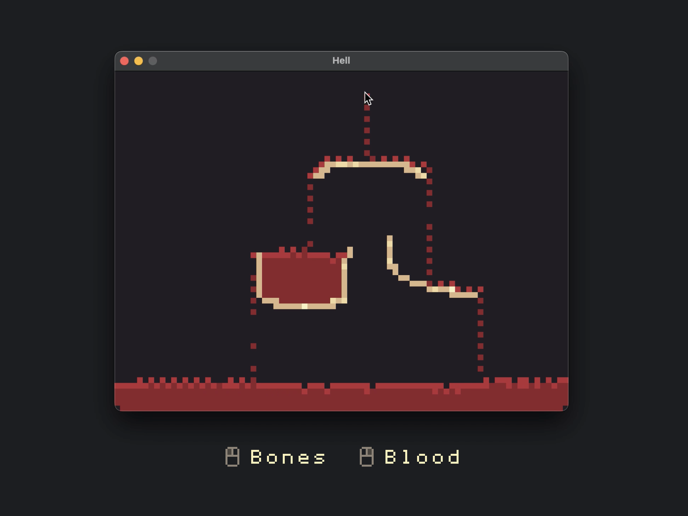

<p align="center"></p>

# Tiny Sandbox game written in Rust (Bevy)

A little sandbox simulation done without physics, just for fun and to learn a bit of Rust using [Bevy](https://bevyengine.org/).

## Run it locally

Clone the project

```bash
  git clone https://github.com/Hugo-Dz/rust-sandbox.git
```

Make sure you have Rust [installed](https://www.rust-lang.org/tools/install) and run the following command

```bash
  cargo run
```

That's it! 🎮

## Is Bevy a good fit for game development?

Bevy [ECS](https://bevy-cheatbook.github.io/programming/intro-data.html) design was very pleasing to work with, it completely changes the way we can implement game logic compared to the Object-oriented paradigm.

To be short, imagine your game as a database where each row may or may not have certain components like Enemy, Health: int, Spell: enum... or any tiny piece of data or just empty markers (like Enemy).

Representing things this way gives you flexibility. For example, you could create a Health component for your game.
You could then have many entities representing different things in your game, such as the player, NPCs, or monsters, all of which can have a Health value (as well as other relevant components).

<p align="center"></p>

Then you can create single pieces of logic (aka Systems) that iterates over all entities with the components matching your query and updates their values. Just like you query a database.

```rust
  #[derive(Component)]
  struct Xp(u32);

  #[derive(Component)]
  struct Health {
      current: u32,
      max: u32,
  }

  fn level_up(
      // operate on anything that has Xp and Health
      mut query: Query<(&mut Xp, &mut Health)>,
  ) {
      for (mut xp, mut health) in query.iter_mut() {
          if xp.0 > 1000 {
              xp.0 -= 1000;
              health.max += 25;
              health.current = health.max;
          }
      }
  }
```

That said, Bevy is more a framework than a game engine, it's still very early and doesn't provide as many features out of the box as Godot for instance. Especially if you need to do fine level design, the absence of an editor can be annoying.
After playing with it for a while, here are my pros and cons about Bevy:

**Pros:**

✅ The ECS design is very powerful and surprisingly satisfying to work with, especially for simulation or data driven games.  
✅ Written in the same language as your game.  
✅ Pretty simple and type-safe! (If you are done to learn a bit of Rust)  
✅ Customizable and extensible. If you want to build something very specific without reinveting the wheel, it's clearly a good choice.  


**Cons:**

❌ No editor, everything sits in your IDE.  
❌ Lack of common features like particles.  
❌ Not really beginner friendly, you need to learn a bit of Rust.  
❌ Not as mature as other game engines, which means less examples and tutorials. That said, the community is very active and helpful on the [Discord](https://discord.gg/bevy)!

## License

MIT License